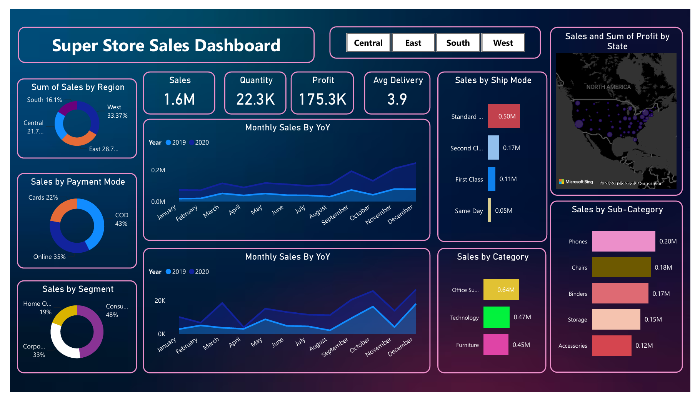
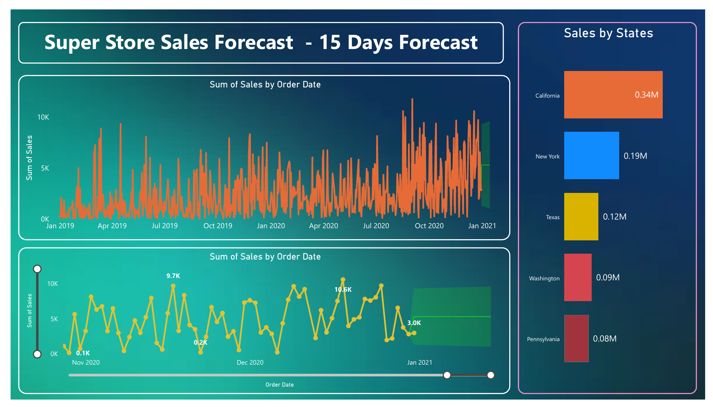

# 📊 Super Store Sales Analysis & Forecasting Dashboard

## Project Overview

This Power BI project analyzes Super Store sales data to uncover key business insights related to sales performance, profitability, customer behavior, shipping preferences, and future sales trends. The dashboard enables stakeholders to monitor KPIs, identify top-performing categories, and make data-driven decisions through interactive visualizations and forecasting.

## Key Features

- Interactive sales dashboard with region-wise filtering.
- KPI tracking for Sales, Profit, Quantity, and Average Delivery Time.
- Sales analysis by Region, Category, Sub-Category, Segment, and Payment Mode.
- Shipping mode performance analysis.
- State-wise sales and profit visualization.
- Year-over-Year (YoY) sales and profit trend analysis.
- 15-Day Sales Forecasting using historical sales data.
- Dynamic filters and interactive visuals for deeper insights.

## Dashboard Preview

### Sales Dashboard

### Sales Forecast Dashboard

## Key Insights

- Total Sales: **$1.6M**
- Total Quantity Sold: **22.3K**
- Total Profit: **$175.3K**
- Average Delivery Time: **3.9 Days**
- West region generated the highest sales contribution.
- Consumer segment accounted for the largest share of sales.
- COD was the most preferred payment method.
- Office Supplies emerged as the top-performing category.
- Phones were the highest-selling sub-category.
- Standard Class was the most frequently used shipping mode.
- California generated the highest sales among all states.

## Forecasting Analysis

- Built a 15-day sales forecast using Power BI forecasting features.
- Identified future sales trends and demand patterns.
- Enabled proactive business planning and inventory management.
- Supported decision-making with predictive analytics.

## Tools & Technologies

- Power BI Desktop
- Power Query
- DAX (Data Analysis Expressions)
- Data Modeling
- Data Cleaning & Transformation
- Forecasting & Trend Analysis
- Interactive Data Visualization

## Business Impact

- Improved visibility into sales and profitability performance.
- Identified high-performing products and customer segments.
- Enabled data-driven decision-making through interactive dashboards.
- Enhanced future planning with sales forecasting insights.

## Skills Demonstrated

- Data Analysis
- Business Intelligence
- Data Visualization
- Dashboard Development
- DAX
- Power Query
- Forecasting
- KPI Reporting
- Data Modeling

